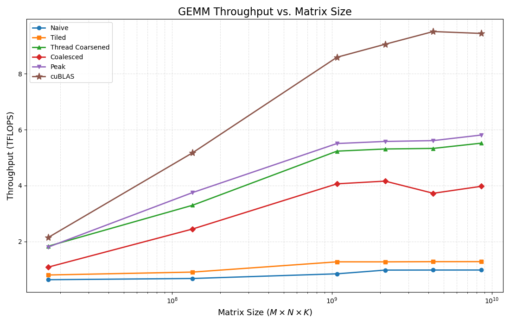

# GEMM Optimization Series in CUDA

This document is an indepth description and documentation of my attempt at optimizing General Matrix Multiplication (GEMM) kernels in CUDA. Some of the optimization techniques that I implemented include tiling, thread granularity coarsening, memory coalescing and corner turning, and bank-confict avoidance.

Each of the kernels was validated and their throughput was benchmarked against cuBLAS. In the end, the best performing kernel I was able to make was a combination of tiling, thread coarsening, and loop unrolling. Many of the optimization techniques that I applied had additional costs that they carried with them, causing the overall performance to drop. These optimizations will also be covered in this document. 

## Table of Contents
- [Overview](#overview)
- [Tiling](#tiling)
- [Thread Coarsening](@thread-coarsening)
- [Memory Coalescing](#memory-coalescing)
- [Other Optimizations](#other-optimizations)
- [Future Plans](#future-plans)

## Overview
The following documentation fully described the progressive GEMM optimization project that I did in CUDA. Starting with a naive matrix multiplication kernel, I implemented various optimization techniques such as tiling, thread coarsening, memory coalescing, end bank conflict avoidance. Each of my kernels is thoroughly documented in the source code and I welcome readers to take a look at my implementations (and feel free to contact me if you find any errors or have questions).

Using a combination of techniques, I was able to achieve a throughput of 5.81 TFLOPS, which is a 5.95x speedup from the naive matrix multiplication kernel, and was 61.6% of the equivalent cuBLAS throughput on the same matrix size. 

For all the kernels, they implemented a GEMM where an M x K matrix A is multiplied by a K x N matrix B. The output matrix C is then a M x N matrix. The naive matrix multiplication kernel applied the finest granularity to threads, applying one thread per element in the output matrix C. Each of these threads then loops across a row of A and a column of B, multiplying corresponding elements and adding them to a collective sum. One should note that the accesses to matrix B are already coalesced since threads read from adjacent columns (multi-dimensional arrays are stored in row-major format). 

While many optimizations can be applied to the method that a kernel takes to multiply matrices, one must still consider effects of Streaming Multiprocessor (SM) occupancy.

One can find the naive kernel at `src/matmul/naive_matmul.cuh`

## Tiling
One of the primary downsides of naive matrix multiplication is that threads read from the same elements in global memory which has relatively high latency. If two threads are calculating elements that are in the same row of the output matrix C, then they would both need to read from the entire row of A. One way to combat this is to let all the threads in a block collectively load individual elements of matrix A and B, then store them into shared memory which had lower latency than global. Once the elements of A and B are stored into shared memory, each thread computed the dot products in the same way as the naive kernel.

One must note that shared memory is much smaller than global memory, and can often not hold all the data from A or B. Thus we break up our computation into smaller parts called tiles. In this implementation, a tile represent a square that corresponds to a subset of elements in our output matrix C. This tile would move across matrix A from left to right and move across matrix B from top to bottom. At each iteration the threads in the tile load a corresponding subset of matrix A and B into shared memory and then computes a portion of the dot product.

One must note that using shared memory and tiling has the added cost of thread synchronization. This is because all threads but finish storing data into shared memory before the partial dot product can be computed. Additionally, threads cannot move on to storing elements of the next tile into shared memory while other threads are still computing dot products. However, this tradeoff is still worth it in comparison to the naive matrix multiplication kernel due to the large overhead from repetitive reads from global memory.

The tiled matrix multiplication implementation can be found at `src/matmul/tile_matmul.cuh`

## Thread Coarsening
Organizing thread work at the finest granularity has the added benefits of easier scaling, and is easiest to implement in problems that are embarrassingly parallel. However, finer thread granularity can introduce additional overhead when threads have repetitive memory access patterns, or have lots of synchronization. We can reduce this added overhead from the tiled matrix multiplication example by increasing the amount of work each thread is responsible for. This is called thread coarsening. 

In this project, I decided to implement 2D thread coarsening. In this case, each thread is responsible for computing a square of matrix elements in which the square has size length `COARSE_FACTOR`. One must note that the `TILE_SIZE` would increase quadratically based on `COARSE_FACTOR` with the same number of threads. Thus 2D thread coarsening has the effect of quadratically increasing the register usage for a block compared to a 1D example. In this way 2D thread coarsening makes the kernel much more hardware sensitive, as the coarsening factor has a much larger potential impact on SMs occupancy. In my case I found that a `BLOCK_SIZE` of `16` (256 threads) and a `COARSE_FACTOR` of `4` (16 output elements per thread) performed best on my RTX4060 laptop GPU. 

The thread coarsened + tiled matrix multiplication implementation can be found at `src/matmul/thread_coarsened.cuh`

## Memory Coalescing
Memory access to DRAM is faster when threads access adjacent elements of memory. This is called DRAM bursting. If we can organize thread accesses in a way such that adjacent threads access adjacent memory locations, we will benefit from faster memory access. Elements of multi dimensional arrays are stored in row-major order. This means that elements of the same row are stored consecutively and elements of the same column are stored 1 row length apart. Thus, organizing threads in a way such that adjacent threads access adjacent columns of your matrix will benefit from DRAM bursting. 

One can observe that memory access to matrix B for native matrix multiplication is already coalesced. This is because two threads that are responsible for computing two adjacent elements of the same row in the output matrix would need to access all of the elements of adjacent columns in matrix B. Coalescing memory access to A is something that must be done manually since adjacent threads in a row of C access the same row of A. To expand on the thread coarsened kernel, I attempted to implement coalesced access for both matrix A and B by decoupling memory access and dot product computation.

The given TILE. which is a square, would be partitioned to threads based on the thread's linear id, which is given by `threadIdx.y * BLOCK_SIZE + threadIdx.x`. The threads are then assigned to elements that correspond to adjacent elements based on their linear id in row-major format. However, this optimization required use of division `/` and modulo `%` in each linear iteration. The resulting kernel ended up having a lower throughput compared to the standard thread coarsened kernel.

This implementation can be found at `src/matmul/coalesced_matmul.cuh`

## Other Optimizations
There are many other optimizations that can be applied that have yet to be covered and have yet to be implemented. Some of the other optimizations I implemented consist of avoid bank conflicts, loop unrolling, and using `__restrict__` to allow for more aggressive optimizations. However, these had significantly less impact on the total throughput compared to the other optimizations. 

A finalized kernel with some of these optimizations can be found at `src/matmul/peak_matmul.cuh`

The results of each kernel discussed can be found at `src/docs/profile_results.txt`

## Future Plans
In the future I will attempt to implement double buffering and potentially make use of the GPU's tensor cores to further accelerate matrix multiplication kernels
